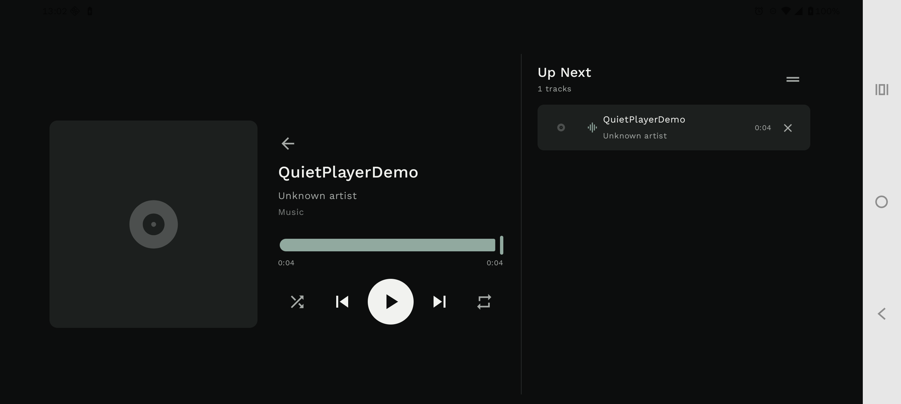

# Quiet Player

スマートフォンをデスクや車載ホルダーへ横置きして使うことを第一に設計した、ローカル音楽プレイヤーです。大きなアルバムアート、必要十分な操作、常時見える再生キューだけに視線を集中させた静かなDark UIを採用しています。



> Motorola edge 50 pro（実機）で撮影。表示確認用のローカル音声を再生しています。

## 実装済み機能

- MediaStoreからSongs / Albums / Artistsを参照
- Android 13以降の`READ_MEDIA_AUDIO`と旧バージョンの`READ_EXTERNAL_STORAGE`を出し分け
- Media3 ExoPlayer + MediaSessionServiceによるバックグラウンド再生
- Play / Pause / Previous / Next / Seek / Shuffle / Repeat all / Repeat one
- ロック画面、通知、Bluetooth・ヘッドセットのメディア操作
- Landscape 62:38のNow Playing / Queueレイアウト
- Portrait用の縦積みレイアウト
- キューから直接再生、削除、長押しドラッグによる並べ替え
- Album Art読み込みとキャッシュ（Coil）
- 再生曲と再生位置の簡易復元
- Edge-to-edgeとSafe Area対応
- External Sessionモード（Apple MusicなどのMediaSessionを表示・操作）
- 外部セッションの曲情報、Album Art、Seek、前後曲、Play / Pause、公開キュー
- Album Artの代表色を減彩した控えめな背景アクセント（External Session）

歌詞、Visualizer、常時アニメーションは意図的に実装していません。

## 技術構成

- Kotlin 2.3 / Jetpack Compose / Material 3
- AndroidX Media3 1.11（ExoPlayer、MediaSession）
- ViewModel / Coroutines / Flow
- MediaStore
- Coil 3
- Gradle 9.6 / Android Gradle Plugin 9.4

構成は小規模アプリ向けに、`data`（端末ライブラリ）、`playback`（サービスとController接続）、ViewModel、Compose UIの4領域へ留めています。不要なDIフレームワークや永続DBは導入していません。

## Build

前提:

- Android Studio（JDK 17以上）
- Android SDK 37 / Build Tools 36以上

```bash
git clone https://github.com/sdrdx4100/android_music_playerrrrrrrrrrrrr.git
cd android_music_playerrrrrrrrrrrrr
./gradlew assembleDebug
```

APKは`app/build/outputs/apk/debug/app-debug.apk`へ生成されます。テストとLintは次で実行できます。

```bash
./gradlew testDebugUnitTest lintDebug
```

## 対応Android Version

- Minimum: Android 6.0（API 23）
- Target: Android 16（API 36）
- Compile: API 37

## Permission

| Permission | 対象 | 用途 |
|---|---|---|
| `READ_MEDIA_AUDIO` | Android 13+ | 端末内の音声ファイル取得 |
| `READ_EXTERNAL_STORAGE` | Android 12L以前 | 端末内の音声ファイル取得 |
| `FOREGROUND_SERVICE` | Android 9+ | バックグラウンド再生 |
| `FOREGROUND_SERVICE_MEDIA_PLAYBACK` | Android 14+ | Media playback foreground service |
| `POST_NOTIFICATIONS` | Android 13+ | メディア通知（MediaSession通知は権限免除対象） |

External Sessionは、初回にAndroid設定画面から「Quiet Player media control」の通知へのアクセスを許可する必要があります。この権限はアクティブなMediaSessionの検出に使用し、通知内容を保存しません。外部キューの内容は再生元アプリが公開する範囲に限られます。

音声データは端末内だけで扱い、外部へ送信しません。

## テスト状況

- `assembleDebug`: 成功
- `testDebugUnitTest`: 成功
- `lintDebug`: 成功（error 0）
- Duration formatter unit tests: 3件

実機確認では、音楽ファイルを入れた端末で権限許可、音声フォーカス、Bluetooth、ロック画面、プロセス再生成を確認してください。

## Known Issues / TODO

- キュー全体はMediaStoreから再構成し、前回曲・位置のみ復元します。任意編集したキュー順の永続化は未対応です。
- Android Auto専用のブラウズツリーは未実装です（標準Bluetooth / headset controlsには対応）。
- 端末メーカーごとのバックグラウンド制限は実機検証が必要です。
- External SessionのShuffle / Repeat操作は、アプリごとに異なるCustom Actionとなるため未対応です。
